基于SpringBoot的船舶维保管理系统（程序+论文）
=
- 完整代码获取地址：从戎源码网 ([https://armycodes.com/](https://armycodes.com/))
- 作者微信：19941326836  QQ：952045282 
- 承接计算机毕业设计、Java毕业设计、Python毕业设计、深度学习、机器学习
- 选题+开题报告+任务书+程序定制+安装调试+论文+答辩ppt 一条龙服务
- 所有选题地址https://github.com/nature924/allProject

一、项目介绍
---
基于Spring Boot框架实现的船舶维保管理系统，系统包含四种角色：管理员、船家、维保人员、维保公司,系统分为前台和后台两大模块，主要功能如下。

### 船家：
- 个人中心：管理个人信息。
- 公告管理：查看和发布系统公告。
- 船舶管理：管理自己的船舶信息。
- 维保公司管理：选择和管理维保公司。
- 维保计划管理：制定和管理船舶的维保计划。
- 故障上报管理：上报船舶的故障情况。

### 维保公司：
- 个人中心：管理个人信息。
- 公告管理：查看和发布系统公告。
- 船舶管理：管理负责的船舶信息。
- 维保人员管理：管理维保人员的信息。
- 维保计划管理：制定和管理船舶的维保计划。
- 故障上报管理：接收和处理船舶的故障上报。
- 维修成本管理：记录和统计维修过程中的成本。

### 维保人员：
- 个人中心：管理个人信息。
- 公告管理：查看系统公告。
- 船舶管理：管理负责的船舶信息。
- 维保计划管理：查看和执行船舶的维保计划。
- 故障上报管理：上报船舶的故障情况。
- 维修成本管理：记录和统计维修过程中的成本。

### 管理员：
- 个人中心：管理个人信息。
- 管理员管理：管理系统管理员的信息。
- 基础数据管理：管理系统的基础数据。
- 公告管理：发布和管理系统公告。
- 船家管理：管理船家的信息。
- 船舶管理：管理所有船舶的信息。
- 维保公司管理：管理维保公司的信息。
- 维保人员管理：管理维保人员的信息。
- 维保计划管理：管理船舶的维保计划。
- 故障上报管理：接收和处理船舶的故障上报。
- 维修成本管理：记录和统计维修过程中的成本。

二、项目技术
---
- 编程语言：Java
- 数据库：MySQL
- 项目管理工具：Maven
- 前端技术：VUE、HTML、Jquery、Bootstrap
- 后端技术：Spring、SpringMVC、MyBatis

三、运行环境
---
- 操作系统：Windows、macOS都可以
- JDK版本：JDK1.8以上都可以
- 开发工具：IDEA、Ecplise、Myecplise都可以
- 数据库: MySQL5.7以上都可以
- Tomcat：任意版本都可以
- Maven：任意版本都可以

四、运行截图
---
### 论文截图：
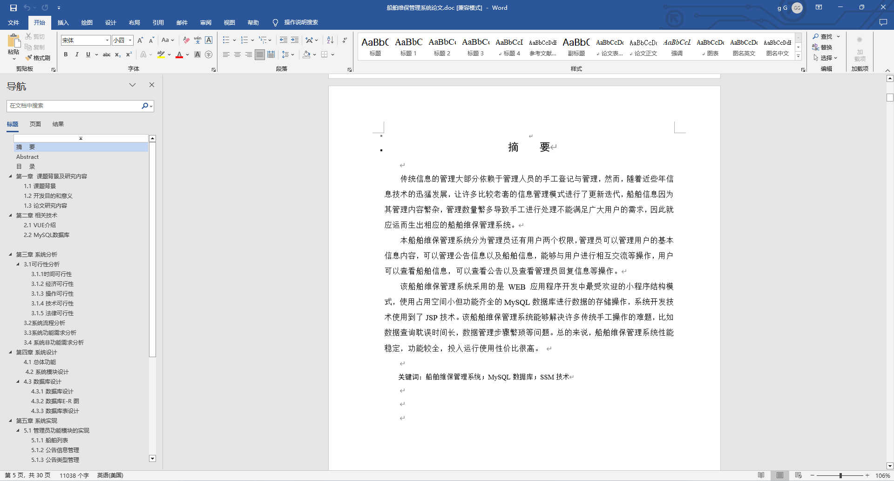
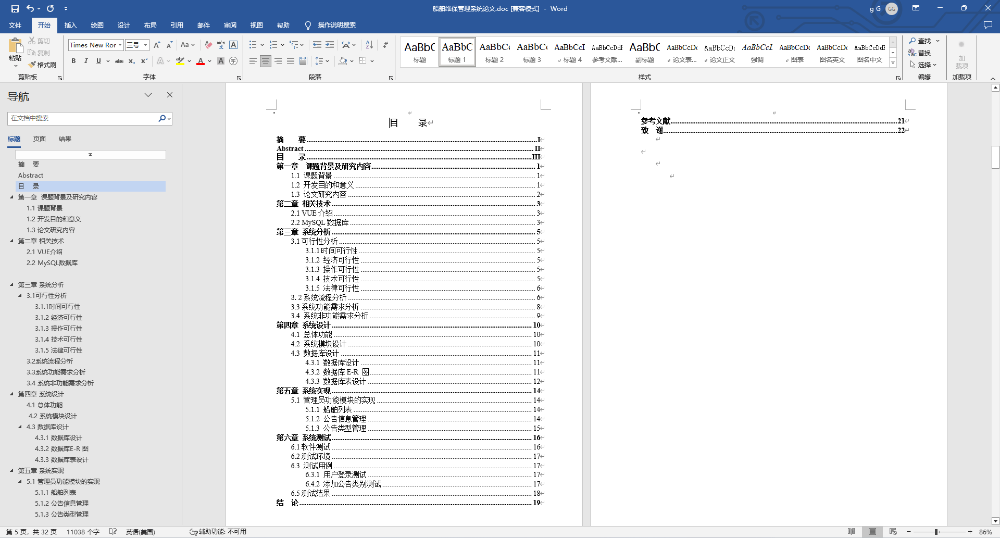

### 程序截图：

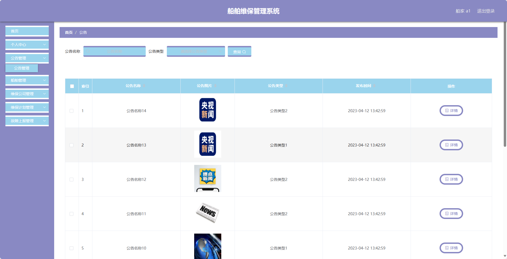
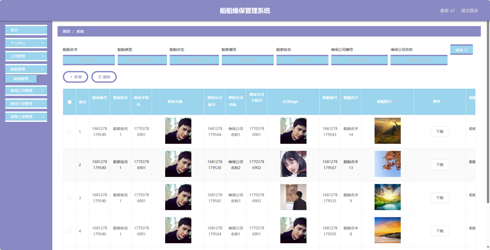
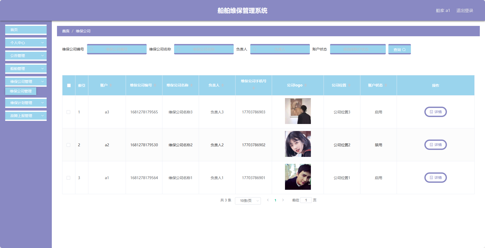
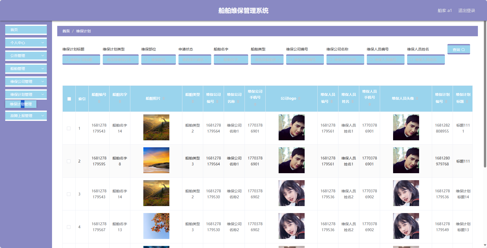
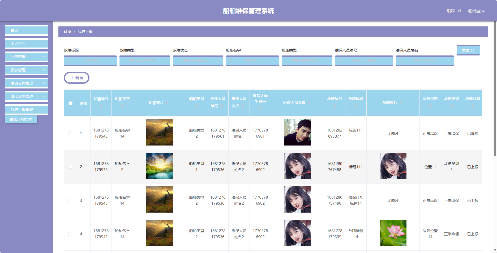
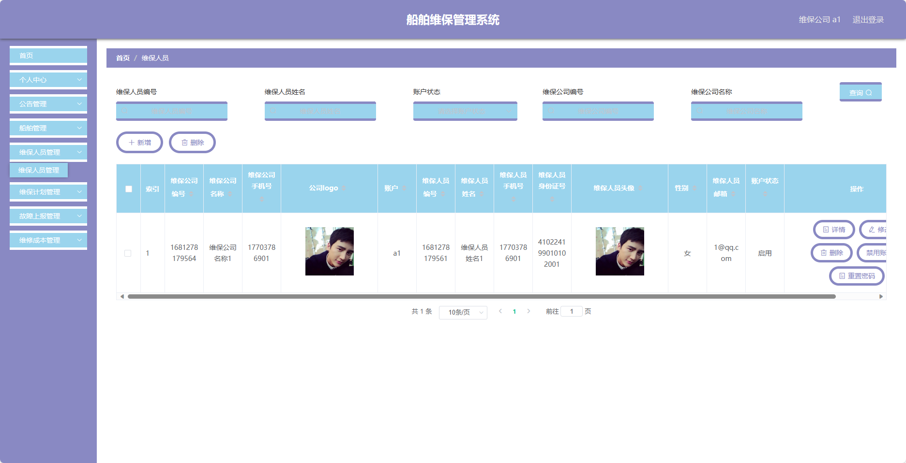
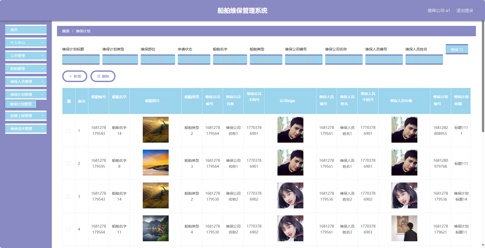
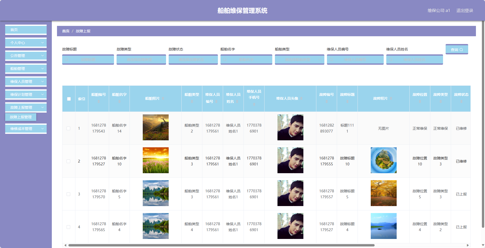
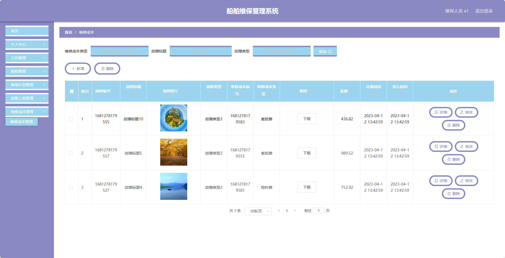

